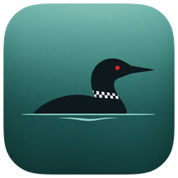

# Gavia

**Find loons in field photographs. Free, open source, and 100% on your computer.**

*A Product of Humanitarians AI*

## What is Gavia?

Gavia is a desktop app for loon research and conservation work. Open a photo, and Gavia draws a box around every loon it finds, with a confidence score for each. Keep the results worth keeping and come back to them later.

It is built to support expert judgment, not to replace it. Every result is meant to be reviewed by a person who knows loons.

Gavia does all its work on your own computer. It **works without internet**, it's **free**, and **your photos never leave your machine**.

## How it works

1. **Install Gavia** and open it. The detection model comes with the app, so there's nothing else to download.
2. **Choose a photo.** JPEG, PNG and WebP all work, including the MPO files many cameras produce, up to 20 MB.
3. **Review and keep.** Check the boxes, give a thumbs up or down, and save the result to your history. You can also download a copy of the photo with the boxes drawn on it.

## Why people use it

|  | Gavia | Uploading to a cloud service |
| --- | --- | --- |
| **Your photos** | Stay on your computer | Sent to someone else's server |
| **In the field** | Works offline | Needs a connection |
| **Cost** | Free | Often per image or per month |
| **Account** | Not needed | Usually required |

- **💻 Runs on an ordinary laptop.** No GPU, no server, a 43 MB download.
- **🎯 Measured.** On the `loonnet_v1` validation photos, Gavia finds 88% of labelled loons, and 91% of the boxes it draws are real loons (details below).
- **🗂️ Keeps a record.** The original photo is saved byte-for-byte next to the boxes, exactly as the reviewer saw them.
- **🧭 Honest about uncertainty.** Every box shows a confidence score, so you can see which ones deserve a closer look.

## Download

**[Go to the downloads page](https://github.com/nikhil-kunapareddy/gavia/releases/latest)** and click the file for your computer:

| Your computer | Download this file |
| --- | --- |
| **Mac** with Apple Silicon (M1 or newer) | the file ending in `.dmg` |
| **Windows** 10 or 11 | the file ending in `-setup.exe` |
| **Linux:** Ubuntu, Debian, Mint or Pop!_OS | the file ending in `.deb` |
| **Linux:** Fedora, RHEL or openSUSE | the file ending in `.rpm` |
| **Linux:** any other distribution | the file ending in `.AppImage` |

### Installing

**Mac**
1. Open the `.dmg` file and drag Gavia into your Applications folder.
2. The first time, right-click Gavia in Applications and choose **Open**, then **Open** again. macOS asks because the app isn't signed with an Apple developer certificate yet. You only need to do this once.

**Windows**
1. Run the `-setup.exe` file.
2. If a blue "Windows protected your PC" box appears, click **More info**, then **Run anyway**. You only need to do this once.

**Linux**
- **`.deb`:** double-click it to install with your software center, or run `sudo apt install ./Gavia_*.deb`.
- **`.rpm`:** double-click it, or run `sudo dnf install ./Gavia-*.rpm`.
- **`.AppImage`:** make it runnable with `chmod +x Gavia_*.AppImage`, then double-click it.

The extra steps on Mac and Windows are there because the app isn't signed by Apple or Microsoft yet.

## Questions

<b>Does anything get sent over the internet?</b>

No. The detector runs on your computer, and Gavia never makes a network connection. There's no account, no analytics and no update check.

<b>How accurate is it?</b>

The current model, `loon_v1`, is a YOLO11s detector trained on the `loonnet_v1` dataset of common loons. On that dataset's validation split (26 photos, 33 labelled loons) it scores:

| Precision | Recall | AP@0.5 |
| --- | --- | --- |
| 0.906 | 0.879 | 0.891 |

It's an early model trained on a small dataset. Use its confidence scores as a starting point for review, not as the answer. It's trained on common loons only.

<b>Where are my saved checks kept?</b>

Only on your computer:

| System | Folder |
| --- | --- |
| macOS | `~/Library/Application Support/Gavia` |
| Windows | `%LOCALAPPDATA%\Gavia` |
| Linux | `~/.local/share/gavia` |

Inside it, `gavia.db` holds the results, `images/` holds your original photos exactly as you opened them, and `thumbs/` holds small previews. You can delete a single check or clear everything from the History screen.

<b>Does it work on Intel Macs?</b>

Not yet. The engine that runs the model, ONNX Runtime, doesn't publish a build for Intel Macs, so the Mac download is for Apple Silicon only. If you need an Intel build, please [open an issue](https://github.com/nikhil-kunapareddy/gavia/issues).

<b>What about drone photos where birds are tiny?</b>

Gavia can split a large photo into overlapping tiles so small birds stay visible to the model. It's off by default because it hurts accuracy on typical photos, where loons are large in the frame: on `loonnet_v1`, precision drops from 0.906 to 0.074 with tiling on. To try it on top-down drone imagery, start Gavia with the environment variable `GAVIA_TILING=true`, and measure the result first (see [CONTRIBUTING.md](CONTRIBUTING.md#measure-accuracy)).

<b>I used an earlier version. Do I lose my history?</b>

No. Gavia keeps saved checks in the same folder and format it always has, so your history is there when you open the new version.

<b>Something isn't working</b>

Please [open an issue](https://github.com/nikhil-kunapareddy/gavia/issues/new/choose) describing what happened and which computer you're on. Windows and Linux support is new, so reports from those systems help a lot.

## What's next

- **Signed installers** for macOS and Windows, so installing takes no extra steps.
- **Batch checking:** a whole folder of photos at once, with a summary you can export.
- **More species and life stages,** as labelled data allows.

The **[roadmap](ROADMAP.md)** has the rest.

## Help build Gavia

Everyone is welcome, and you don't have to write code. Bug reports, labelled photos, ideas and design feedback all help.

| If you know… | You could work on… |
| --- | --- |
| **React and TypeScript** | The screens: checking, reviewing, history |
| **Rust**, or want to learn it | Image decoding, the detector, storage, and Windows and Linux support |
| **Computer vision** | Training and evaluating better models |
| **Loons** | Labelling photos and telling us where the model gets it wrong |

Start with the **[contributing guide](CONTRIBUTING.md)**. It explains how to set up your computer, run and test Gavia, and send your first change.

## Licence

AGPL-3.0. The detector is derived from Ultralytics YOLO11, which is AGPL-3.0, and that obligation carries to anything distributed with these weights. See [LICENSE](LICENSE).

---

**If Gavia helps your fieldwork, a star helps other researchers find it.**

